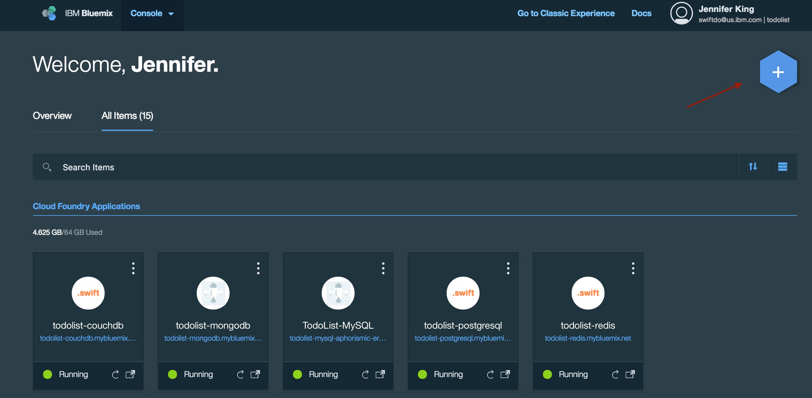
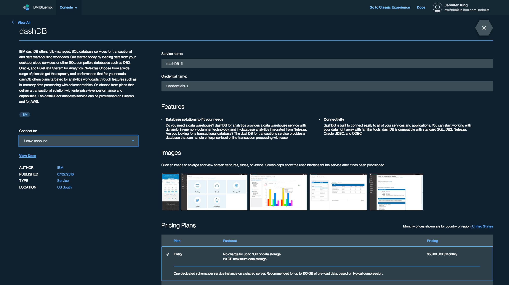
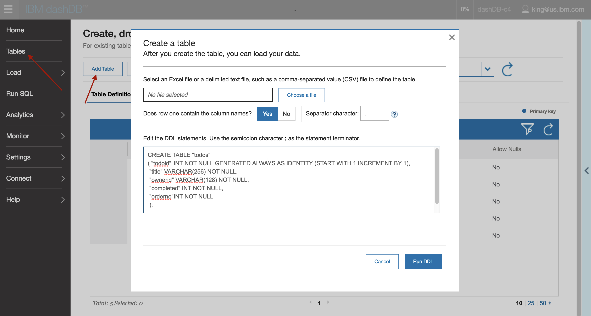
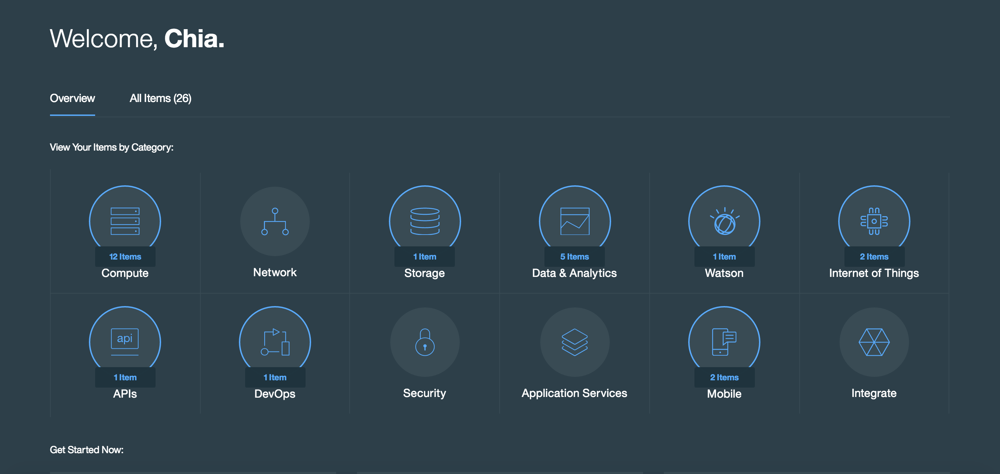
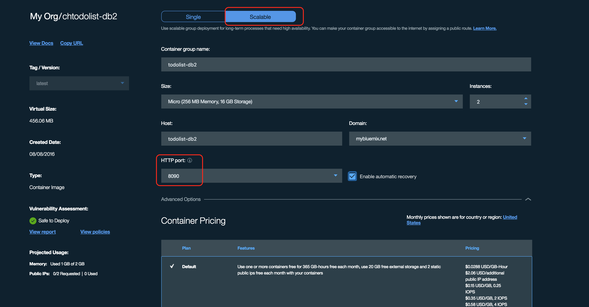

# TodoList DB2 backend

[](https://travis-ci.org/IBM-Swift/TodoList-DB2)


## Table of Contents
* [Summary](#summary)
* [Installation](#installation)
* [Setup DB2 service](#setup-db2-service)
* [Deploy to Bluemix](#deploy-to-bluemix)
* [Compile and run tests](#compile-and-run-tests)

## Summary
A [Swift DB2](https://github.com/IBM-DTeam/swift-for-db2) implementation of the TodoList backend

## Installation:

1. Install [Swift 3](http://www.swift.org)

  [XCode 8](http://www.developer.apple.com/xcode) if on macOS or the toolchain if on Linux

2. Install dependencies:

  macOS: 
  `brew install wget unixodbc`
  
  Linux: 
  `sudo apt-get update`
  `sudo apt-get install -y clang unixodbc-dev unzip wget tar`
  
3. Install the DB2 system driver:

  `wget https://github.com/IBM-DTeam/swift-for-db2-cli/archive/master.zip && unzip master.zip && cd swift-for-db2-cli-master && sudo ./cli.sh && . env.sh && cd .. && rm -f master.zip && rm -rf swift-for-db2-cli-master`
  
5. Clone the repository:
 
  `git clone https://github.com/IBM-Swift/todolist-db2`

6. Compile the application

  macOS: 
  `swift build -Xcc -I/usr/local/include -Xlinker -L/usr/local/lib`
  
  Linux: 
  `swift build -Xcc -I/usr/local/include -Xlinker -L/usr/local/lib`
  
  
##Setup DB2 service
1. Login to your [Bluemix](https://new-console.ng.bluemix.net/?direct=classic) account (create an account, if necessary)  

2. Open the Bluemix catalog by clicking the blue hexagon '+' icon
  

3. Search for "DB2" and open the dashDB Database
  

4. Select your desired plan and click the Create button. 
  
  You will now have a provisioned dashDB Database in your services.

5. Open the newly created service in Bluemix, then open the dashDB dashboard. 

6. Select "Tables" from the menu on the left, then click "Add Table" button. Enter the following DDL statement to create your TODOS table:

  ```
 CREATE TABLE "todos"
 (
  "todoid" INT NOT NULL GENERATED ALWAYS AS IDENTITY (START WITH 1 INCREMENT BY 1),
  "title"	VARCHAR(256) NOT NULL,
  "ownerid" VARCHAR(128) NOT NULL,
  "completed" INT NOT NULL,
  "orderno" INT NOT NULL
 );
  ```

  

## Using Docker

1. Install Docker on your operating system

2. Build the Docker image:

  `sudo docker build -t todolist-db2 . `

3. Run the web server:

  `sudo docker run -p 8090:8090 -d todolist-db2`
  
##Deploy to Bluemix
To deploy this app to Bluemix, you have to build and a deploy a Docker image with the app.

1. Login to your [Bluemix](https://new-console.ng.bluemix.net/?direct=classic) account (create an account, if necessary) 

2. Download and install the [Cloud Foundry tools](https://new-console.ng.bluemix.net/docs/starters/install_cli.html):

  `cf login`
  
  `bluemix api https://api.ng.bluemix.net`
  
  `bluemix login -u username -o org_name -s space_name`
  
3. Download and install the [IBM Container's Plugin] (https://console.ng.bluemix.net/docs/containers/container_cli_cfic_install.html)

4. Build the Docker image:

  `sudo docker build -t todolist-db2 . `
  
5. Log into cf ic
   
  `cf ic login`
  
6. Tag the Docker image:

  `docker tag todolist-db2 registry.ng.bluemix.net/<ORGANIZATION_NAME>/todolist-db2`

7. Push the Docker image: 
  
  `docker push registry.ng.bluemix.net/<ORGANIZATION_NAME>/todolist-db2`

8. Go to Bluemix and click on `All Items`
 
  

9. Click on the `+` sign to create a new Container
  
  

10. Select the Docker image that was pushed in Step 7 

  

11. Configure the Container as follows (Make sure to switch from `Single` to `Scalable Group` near the top of the page)

  

12. Create the Container. If done correctly, the Container group's URL will have the database's info.
  
##Compile and run tests

1. Clone the Tests to your project:

  `git clone https://github.com/IBM-Swift/todolist-tests Tests`

2. Build the project: 

  macOS: 
  `swift build -Xcc -I/usr/local/include -Xlinker -L/usr/local/lib`
  
  Linux: 
  `swift build -Xcc -I/usr/local/include -Xlinker -L/usr/local/lib`

3. Run the tests:

  `swift test`


