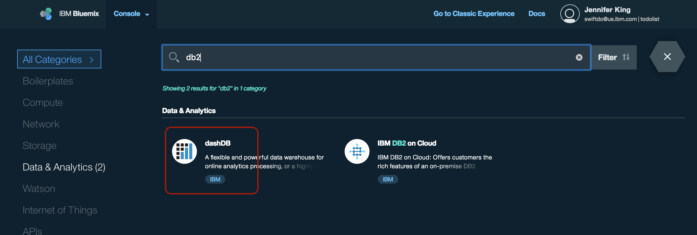

# TodoList DB2 backend

[](https://swift.org/download/#snapshots)

## Table of Contents
* [Summary](#summary)
* [Installation](#installation)
* [Setup DB2 service](#setup-db2-service)
* [Deploy to Bluemix](#deploy-to-bluemix)
* [Compile and run tests](#compile-and-run-tests)

## Summary
A [Swift DB2](https://github.com/IBM-DTeam/swift-for-db2) implementation of the TodoList backend

## Installation:

1. Download and install the [Swift DEVELOPMENT 06-20 snapshot](https://swift.org/download/#snapshots) Make sure you update your toolchain and path, as described in the install instructions.

2. Install dependencies:

  macOS: 
  `brew install wget unixodbc`
  
  Linux: 
  `sudo apt-get update`
  `sudo apt-get install -y clang unixodbc-dev unzip wget tar`
  
3. Install the DB2 system driver:

  `wget https://github.com/IBM-DTeam/swift-for-db2-cli/archive/master.zip && unzip master.zip && cd swift-for-db2-cli-master && sudo ./cli.sh && . env.sh && cd .. && rm -f master.zip && rm -rf swift-for-db2-cli-master`
  
4. (Linux only) Clone, build and install the libdispatch library. The complete instructions for building and installing this library are here, though, all you need to do is just this: 

 `git clone -b experimental/foundation https://github.com/apple/swift-corelibs-libdispatch.git && cd swift-corelibs-libdispatch && git submodule init && git submodule update && sh ./autogen.sh && ./configure --with-swift-toolchain=<path-to-swift>/usr --prefix=<path-to-swift>/usr && make && make install`
  
5. Clone the repository:
 
  `git clone https://github.com/IBM-Swift/todolist-db2`

6. Compile the application

  macOS: 
  `swift build -Xcc -I/usr/local/include -Xlinker -L/usr/local/lib`
  
  Linux: 
  `swift build -Xcc -fblocks -Xcc -I/usr/local/include -Xlinker -L/usr/local/lib`
  
  
##Setup DB2 service
1. Login to your [Bluemix](https://new-console.ng.bluemix.net/?direct=classic) account (create an account, if necessary)  

2. Open the Bluemix catalog by clicking the blue hexagon '+' icon
  

3. Search for "DB2" and open the dashDB Database
  

4. Select your desired plan and click the Create button. 
  
  You will now have a provisioned dashDB Database in your services.

5. Open the newly created service in Bluemix, then open the dashDB dashboard. 

6. Select "Tables" from the menu on the left, then click "Add Table" button. Enter the following DDL statement to create your TODOS table:

  ```
 CREATE TABLE "todos"
 (
  "todoid" INT NOT NULL GENERATED ALWAYS AS IDENTITY (START WITH 1 INCREMENT BY 1),
  "title"	VARCHAR(256) NOT NULL,
  "ownerid" VARCHAR(128) NOT NULL,
  "completed" INT NOT NULL,
  "orderno" INT NOT NULL
 );
  ```

  

##Deploy to Bluemix
1. Login to your [Bluemix](https://new-console.ng.bluemix.net/?direct=classic) account (create an account, if necessary) 

2. Download and install the [Cloud Foundry tools](https://new-console.ng.bluemix.net/docs/starters/install_cli.html):
```
cf login
bluemix api https://api.ng.bluemix.net
bluemix login -u username -o org_name -s space_name
```

    Be sure to change the directory to the todolist-db2 directory where the manifest.yml file is located.

3. Run `cf push`

    #### Note: The uploading droplet stage should take several minutes. If it worked correctly, it should say:
```
2 of 2 instances running
App started
```


##Compile and run tests
1. Clone the Tests to your project:

  `git clone https://github.com/IBM-Swift/todolist-tests Tests`

2. Build the project: 

  macOS: 
  `swift build -Xcc -I/usr/local/include -Xlinker -L/usr/local/lib`
  
  Linux: 
  `swift build -Xcc -fblocks -Xcc -I/usr/local/include -Xlinker -L/usr/local/lib`

3. Run the tests:

  `swift test`


